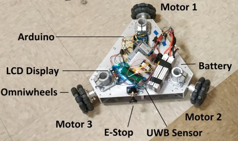
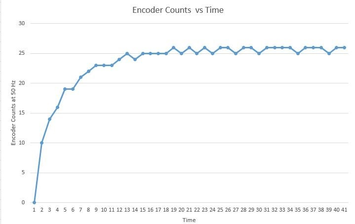
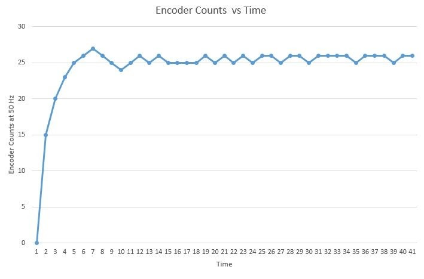
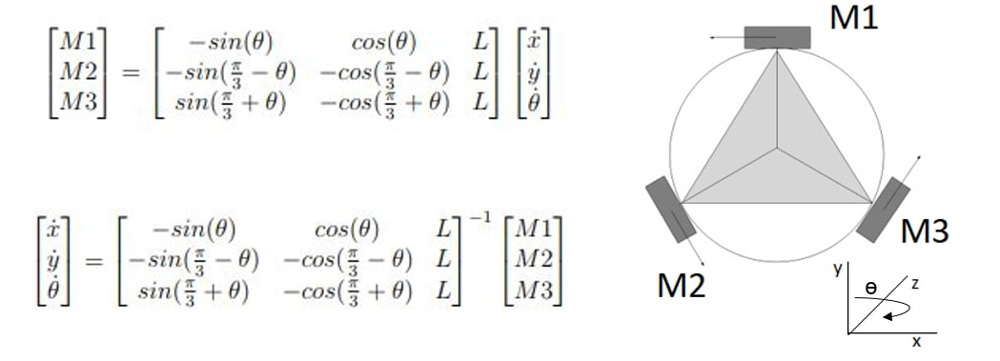

# Vectoring: 3 Wheeled Omni-Directional System
Vectoring code for a three wheel omni chassis written for Arduino Microcontroller.   

## DC Motor Speed Control
Motor speed control using encoders. Encoder are connected to the hardware interrupt of the microcontroller(Arduino Mega). A timer using the timming interrupt service routine is used to measure the motor rotation speed. System Identification is performed to approximate the DC motors as 2nd order system. PID controller is implemented for speed control. 
### Step Response without PID:

### Step Response with PID: 

## Vectoring
X and Y vector (or Magnitude, Theta) are transformed to the three motor RPMs.

## High Level Control
### 1. Control via Serial: 
Command from serial monitor is parsed and fed as arguments to vectoring function. This functionality is added for the control of robot via ROS running on Nvidia Jetson.
### 2. RC Control: 
The code contains a override to signal to control the robot using a Remote Controller.  
